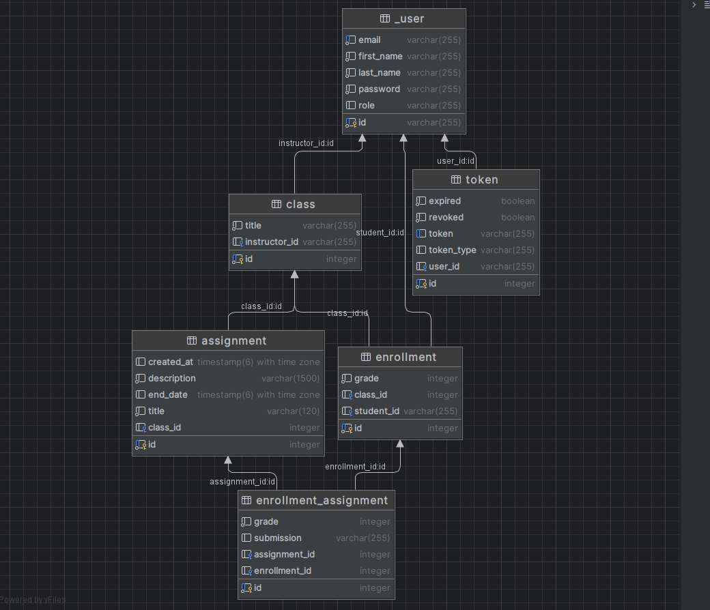
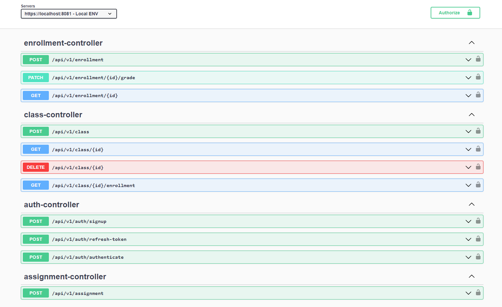

# Student Management App

[Student Management App](https://github.com/cico643/spring-student-management-app) has been put together to bring students and their instructors together for facilitating online class management and assignment follow-ups.

## Features
* User registration and login with JWT authentication
* Password encryption using BCrypt
* Role-based authorization with Spring Security
* Customized access denied handling
* Logout mechanism
* Refresh token
* Unit Testing
* Swagger / OpenApi

## Technologies
* Spring Boot 3.0
* Spring Security
* PostgreSQL
* Hibernate and Spring Data JPA
* JSON Web Tokens (JWT)
* BCrypt
* Maven
* JUnit and Mockito

### Database Diagram

    

### API Documentation

A Swagger UI has been implemented to facilitate the inspection of the API. After running the server, you can reach out to it with a get request to **/swagger-ui/index.html** route.

    

### Logging

In the development stages, 2 types of logging features have been implemented.

- The first one is a CommonsRequestLoggingFilter to automatically log all the HTTP requests that come to our server.

- The second one is a custom logger that can manually log valuable information on the application runtime (e.g. DML query commit), to the standard output with desired log level. This logger is widely used around the application to help understand app status when running on the production environment.

### Getting Started
To get started with this project, you will need to have the following installed on your local machine:

* JDK 17+
* Maven 3+
* Docker and Docker Compose

To build and run the project, follow these steps:

* Clone this repository
* Create **docker.env** file as shown in the **docker-env.example** file and fill the configs
* On the root directory, run: **docker-compose up**
* Build the project: **mvn clean install**
* Run the project: **mvn spring-boot run**

-> The application will be available at http://localhost:8081

### Testing

To run all the tests written in the test directory: **mvn test**
